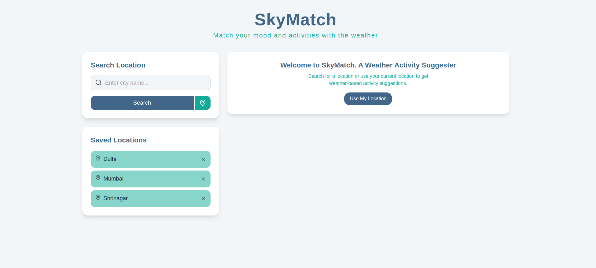
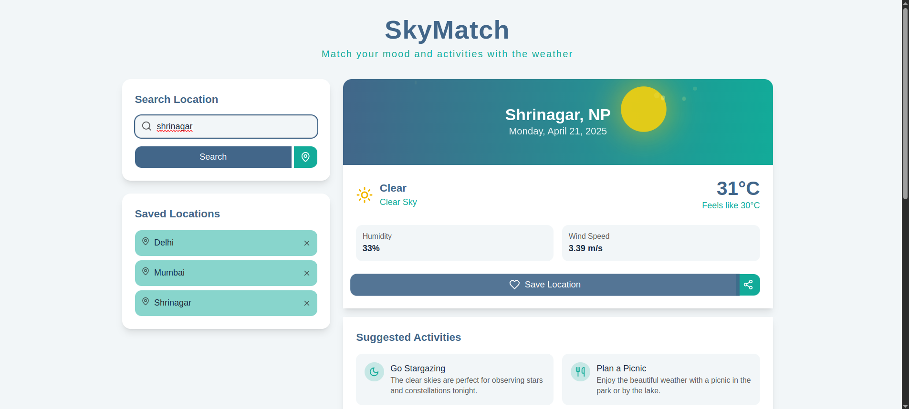

# SKYMATCH

Welcome to the SkyMatch, a simple and intuitive weather application developed using Next.js and open weather api. It shows the weather data according to searches or with your location and also suggest activities based on weather.




## Features

- ** Location Search**  
  City name input
- ** Real-Time Weather Display**  
  Temperature, conditions, and location visualization
- ** Smart Suggestions**  
  Context-aware activity recommendations
- ** Added weather icons or animations **
- ** It include a 5-day forecast with activity suggestions for each day
  Enabled geolocation to auto-detect the user’s location (with permission) **
- ** Allow users to save favorite locations using localStorage **
- ** Added a "Share" button to post weather and activity ideas on social media **
- ** Mobile-First Design **  
  Fully responsive across devices
- ** Error Handling**  
  User-friendly error messages

## Technologies

- Next.js
- TaiwindCss
- Framer motion
- lucide-react
- Fetchs for API calls

**API**

- OpenWeatherMap Current Weather Data

## Installation

1. Clone repo

   ```bash
   git clone https://github.com/AnchalDevBytes/skyMatch.git
   cd skyMatch
   ```

2. Install dependencies

   ```bash
   npm install
   ```

3. Add API Key

```bash
NEXT_PUBLIC_OPENWEATHER_API_KEY=<Put_Your_OpenWeather_API_Key>
```

4. Start dev server

```bash
npm run dev
```

5. Open [http://localhost:3000](http://localhost:3000) in your browser.

6. **Deployment:**
   Deployed on vercel : [live](https://sky-match-liart.vercel.app/)

7. **Submitted by:**

Anchal Raj (anchalraj20045@gmail.com)
